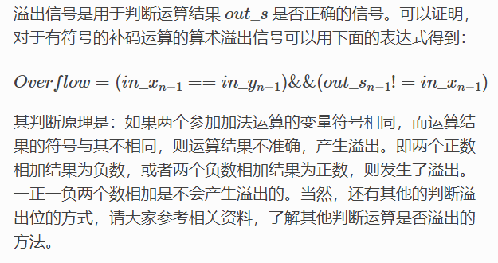
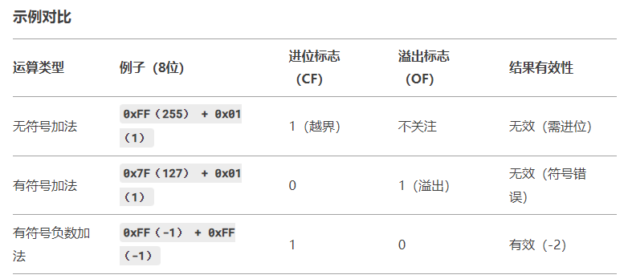

[toc]

---
# verilog语言学习

## 知识补漏
1. **求补码时符号位到底要不要取反？**
    简单说就是，一个是求反码（符号位不反），另一个是计算机实际应用的操作（全取反再+1），两种方式的结果都相同。
    PS：正数的补码就是本身，不要再求补码啦！！！:cry:
    [二进制整数-原码反码补码-求反码时符号位是否取反？](https://www.jianshu.com/p/18f3831fa0d6)
2. **移位**
  - **算术移位**: 符号位不变 `Q <= { Q[7], Q[7:1] }`
  - **逻辑移位**: 空缺位补0 ` Q <= { 0, Q[7:1] }`
  - **循环移位**: 最低位补最高位 `Q <= { Q[0] , Q[7:1] } `

## 模块逻辑
  1. **加法器**
   - 算术溢出信号
    
   - 进位信号—— `{out_c,out_s} =in_x + in_y;`
   - **为什么说有符号数运算只看溢出位，无符号数只看进位**
    无符号数：溢出等同于进位。若CF=1，说明结果超出当前位数范围，必须处理进位。
    有符号数：补码运算中，进位可能**正常存在**（如负数的加法），但**不直接反映**结果**有效性**，故忽略。
      
  2. **状态机**
    - **状态编码方式的选择**
      一般而言，顺序二进制编码和gray-code的状态机使用了最少的触发器，较多的组合逻辑，适用于提供更多的组合逻辑的CPLD芯片。对于具有更多触发器资源的FPGA，用one-hot编码实现状态机则更加有效。所以CPLD多使用gray-code，而FPGA多使用one-hot 编码。对于触发器资源非常丰富的FPGA器件，使用one-hot是常用的。

## 声明模块的tips
  1. `#(NR_KEY = 2, KEY_LEN = 1, DATA_LEN = 1)`是参数化模块的方式,实例化时可灵活修改#()中参数
   ```
   module MuxKey #(NR_KEY = 2, KEY_LEN = 1, DATA_LEN = 1) (
        output [DATA_LEN-1:0] out,
        input [KEY_LEN-1:0] key,
        input [NR_KEY*(KEY_LEN + DATA_LEN)-1:0] lut
    );
    MuxKeyInternal #(NR_KEY, KEY_LEN, DATA_LEN, 0) i0 (out, key, {DATA_LEN{1'b0}}, lut);
  endmodule
  ```